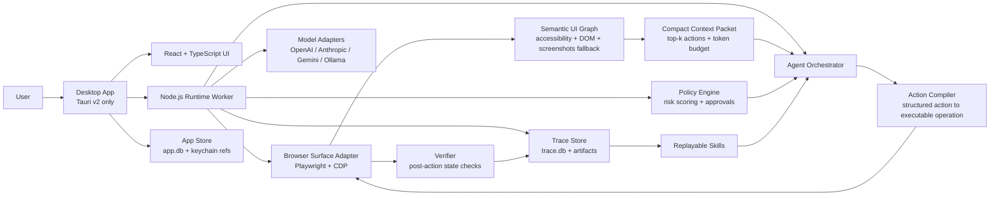

# Project Structure Graph

This graph documents the current scaffold and planning structure before implementation starts.

```mermaid
flowchart TD
  Repo["codepawl/"]

  Repo --> Agents["AGENTS.md<br/>Repository guidance for Codex and agents"]
  Repo --> Codex[".codex/<br/>Planning and implementation guidance"]

  Codex --> Plan["plan/<br/>Product planning, setup, roadmap, PRD, backlog"]
  Codex --> UI["ui/<br/>UI/UX design source"]
  Codex --> Technical["technical/<br/>Architecture and engineering notes"]
  Codex --> Skills["skills/<br/>CodePawl-specific Codex skills"]

  Plan --> PlanReadme["00_README.md<br/>Plan pack entrypoint"]
  Plan --> Vision["02_vision_north_star.md<br/>North star and product thesis"]
  Plan --> Master["03_master_plan.md<br/>MVP pillars and maturity roadmap"]
  Plan --> Scope["04_mvp_scope_feature_breakdown.md<br/>P0/P1/P2 scope"]
  Plan --> PRD["05_product_requirements_prd.md<br/>Requirements and acceptance test"]
  Plan --> Stack["13_technology_stack.md<br/>Preferred stack decisions"]
  Plan --> Backlog["42_implementation_backlog.md<br/>Implementation checklist"]

  UI --> UIDirection["02_ui_direction.md<br/>Current UI direction"]
  UI --> IA["03_information_architecture.md<br/>Desktop IA"]
  UI --> Routes["04_mvp_routes.md<br/>Route guidance"]
  UI --> Screens["05_screen_specs.md<br/>Screen requirements"]
  UI --> Components["09_component_inventory.md<br/>Component guidance"]

  Technical --> TechReadme["README.md<br/>Technical folder purpose"]
  Technical --> FutureADR["Future ADRs<br/>Shell, storage, model adapters, policy, packaging"]
  Technical --> FutureRuntime["Future runtime notes<br/>Surface adapters, traces, verification, token economy"]

  Skills --> SkillsReadme["README.md<br/>CodePawl-specific skill rules"]
  Skills --> FutureSkills["Future app skills<br/>Only workflows unique to CodePawl"]

  Repo --> Apps["apps/desktop<br/>Tauri v2 app shell"]
  Repo -. future implementation .-> Packages["packages/<br/>shared, ipc-contracts, runtime-sidecar, surface-core"]
  Repo -. optional future .-> Crates["crates/<br/>Optional Rust/Tauri/system crates"]
  Repo -. future support .-> Docs["docs/<br/>Public docs and ADRs after code exists"]
  Repo -. future support .-> Tests["tests / evals<br/>Integration tests and task evals"]
```

## Intended Future Code Layout

```mermaid
flowchart LR
  User["User"] --> Desktop["Desktop App<br/>Tauri v2 only"]
  Desktop --> UI["React + TypeScript UI"]
  Desktop --> Runtime["Node.js Runtime Worker"]

  Runtime --> BrowserSurface["Browser Surface Adapter<br/>Playwright + CDP"]
  Runtime --> Orchestrator["Agent Orchestrator"]
  Runtime --> TraceStore["Trace Store<br/>trace.db + artifacts"]
  Runtime --> Policy["Policy Engine<br/>risk scoring + approvals"]
  Runtime --> Models["Model Adapters<br/>OpenAI / Anthropic / Gemini / Ollama"]
  Desktop --> AppStore["App Store<br/>app.db + keychain refs"]

  BrowserSurface --> Observation["Semantic UI Graph<br/>accessibility + DOM + screenshots fallback"]
  Observation --> Context["Compact Context Packet<br/>top-k actions + token budget"]
  Context --> Orchestrator
  Orchestrator --> Compiler["Action Compiler<br/>structured action to executable operation"]
  Compiler --> BrowserSurface
  BrowserSurface --> Verifier["Verifier<br/>post-action state checks"]
  Verifier --> TraceStore
  Policy --> Orchestrator
  TraceStore --> Skills["Replayable Skills"]
  Skills --> Orchestrator
```
