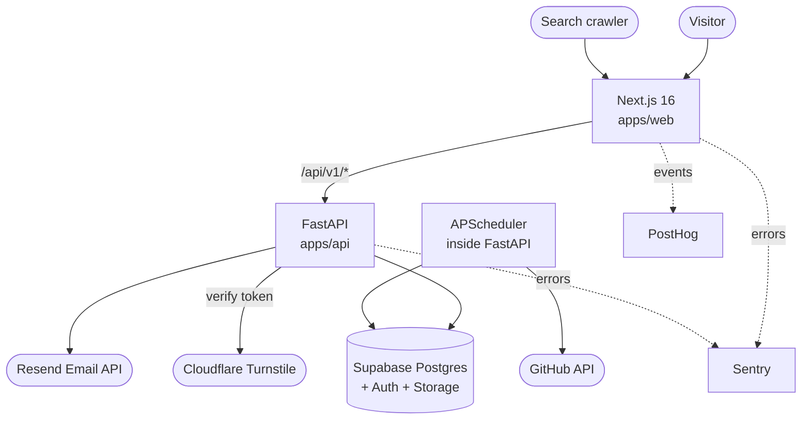
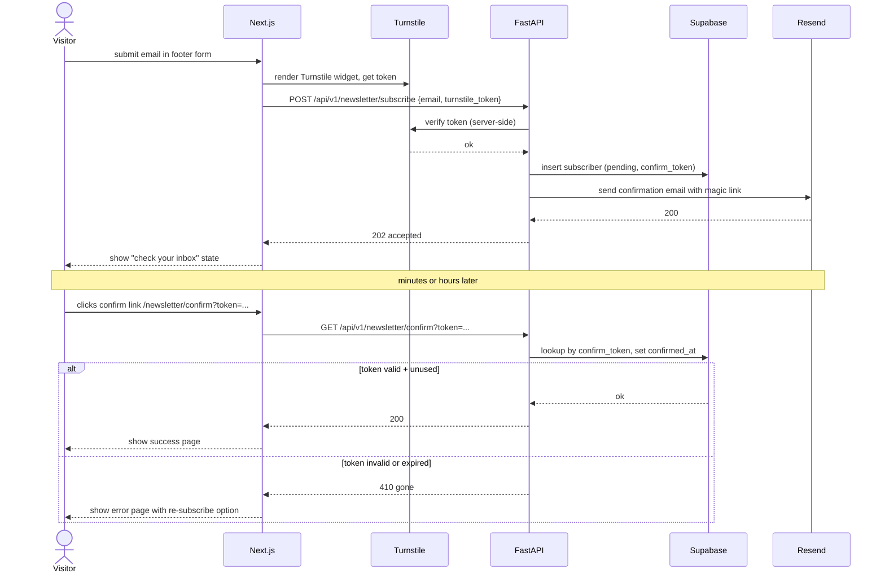
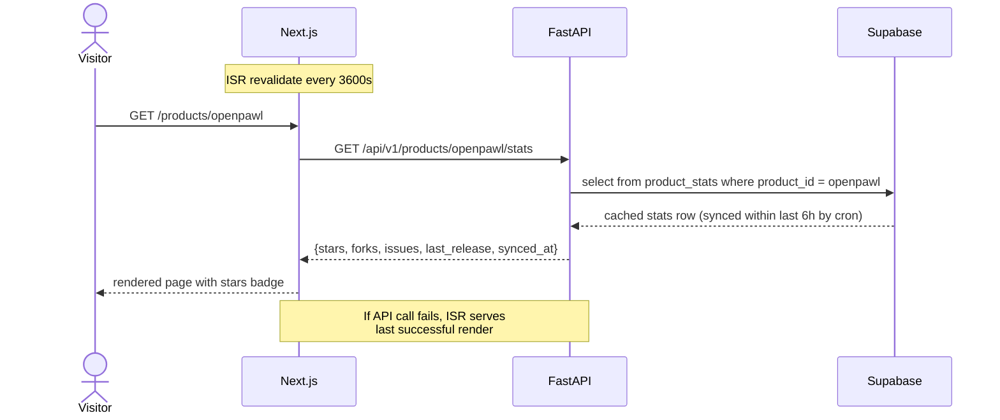
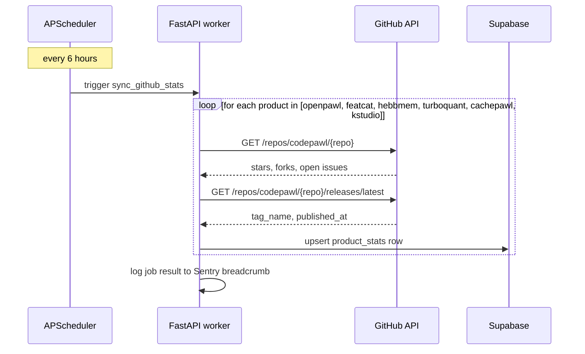
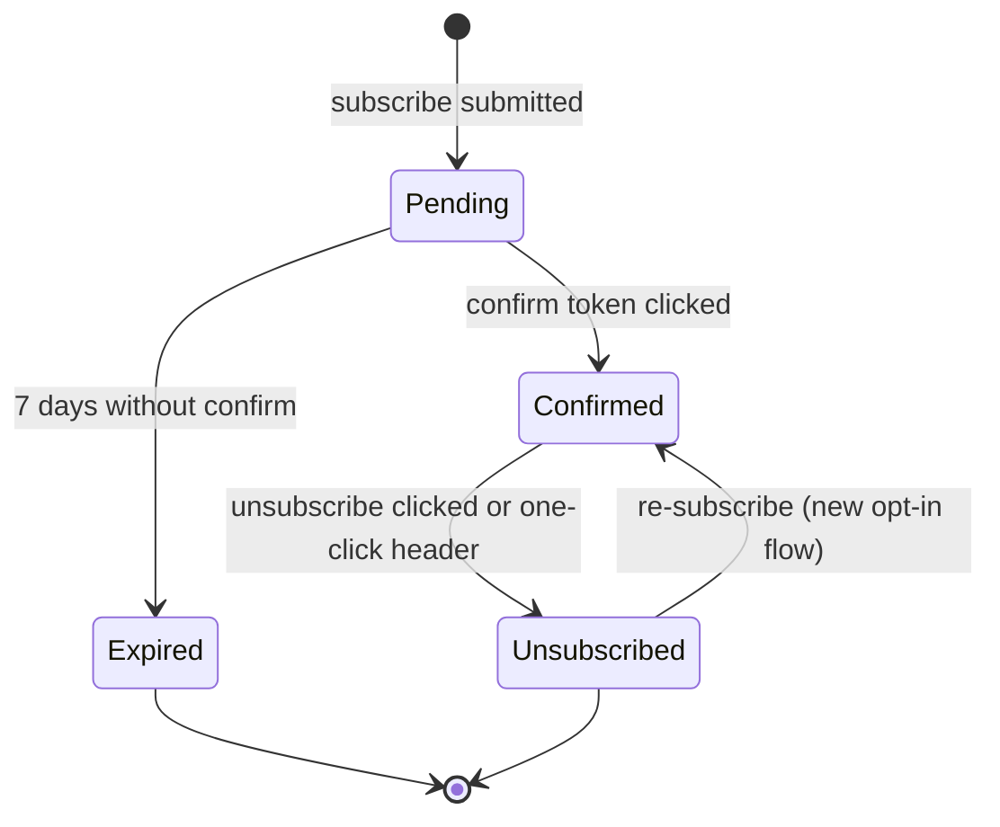

# Architecture

## Stack rationale

**Next.js 16 App Router for the web.** React Server Components reduce the JS shipped on marketing pages, which is the dominant traffic. ISR covers the static-with-occasional-update pattern (product stats, blog index) without a custom cache layer. App Router enables route groups, which we use to separate marketing from app shells.

**FastAPI on Koyeb as the single backend gateway.** Python because the team's domain is AI/ML. FastAPI gives Pydantic validation, OpenAPI, async support, and middleware composition without ceremony. Koyeb because it deploys from git, scales to zero, and supports background workers in the same service.

**Supabase Postgres for data, Auth, Realtime, Storage.** One vendor, four services, less integration glue. Auth is the most valuable piece: OAuth providers and email auth come free. Marketing site does not need user state, but the `(app)` route group will.

**Bun workspaces for the monorepo.** Bun installs and runs faster than npm/pnpm. Workspace packages are normalized around `apps/*` and `packages/*`. Workspaces isolate the Next.js frontend (`web`), shared interfaces (`shared`), the Openpawl core agent loop (`core`), and the CLI tool (`cli`) cleanly.

**Tailwind v4 with CSS-first config.** Design tokens live in `@theme` directives, generating utilities automatically. The sharp-corner design system is enforced at the token level.

## System diagram

## Components

### apps/web (Next.js 16)

- **Responsibility**: Render all public-facing pages, handle client-side form state, fetch data from FastAPI via ISR, render MDX (blog, research, careers, docs).
- **Path**: `apps/web/`
- **Depends on**: `apps/api` (HTTP), `@codepawl/shared` (types)
- **Depended on by**: end users and search engines

Internal layout:

- `app/(marketing)/` route group: landing, products, research, docs, blog, careers, pricing, contact. No Ant Design. ISR with `revalidate = 3600` default.
- `app/(app)/` route group: reserved for future authenticated app (community, admin). Wraps `AntdConfigProvider`. Out of MVP scope but the directory exists.
- `app/api/` route handlers: only for things that must run on Vercel/Next runtime (image optimization, webhook receivers if we add them). Not for general API. General API lives in `apps/api/`.
- `components/marketing/` per-section components from the design template: Nav, Hero, Features, Formats, SDKDemo, Pricing, Testimonials, TrustedBy, CTA, Footer.
- `lib/fonts.ts` Next/font/local configuration for Fraunces, Inter Tight, JetBrains Mono.
- `lib/api.ts` typed fetch client for the FastAPI backend, with graceful ISR fallback.
- `styles/design-tokens.css` ports `colors_and_type.css` from the template into `:root` and `@theme`.

### apps/api (FastAPI)

- **Responsibility**: Single HTTP gateway to Supabase, handles newsletter, contact, product stats, admin endpoints. Runs the GitHub stats sync job.
- **Path**: `apps/api/`
- **Depends on**: Supabase Postgres, Resend API, GitHub API, Cloudflare Turnstile verify endpoint
- **Depended on by**: `apps/web`

Internal layout:

- `app/main.py` FastAPI app factory, middleware setup (CORS, Sentry, slowapi).
- `app/routers/` one router per domain: `newsletter.py`, `contact.py`, `products.py`, `admin.py`, `health.py`.
- `app/services/` business logic, no FastAPI imports: `newsletter_service.py`, `email_service.py`, `github_service.py`, `turnstile_service.py`.
- `app/repositories/` Supabase data access, no business logic: `subscriber_repo.py`, `submission_repo.py`, `product_stats_repo.py`.
- `app/models/` Pydantic models for request/response and DB entities. Shared shapes go through `packages/shared` as JSON schema, but Pydantic is the source of truth on the server.
- `app/auth/` JWT verification dependency, admin API key check.
- `app/jobs/` APScheduler job definitions: `sync_github_stats.py`.
- `migrations/` Supabase SQL migrations, timestamped.

### packages/core (TypeScript)

- **Responsibility**: Implement the Openpawl core agent framework, including LangGraph agent orchestration (`StateGraph`), the auditing and token-tracking trace ledger (`TraceLedger`), and state memory interfaces (`MemoryManager`).
- **Path**: `packages/core/`
- **Depends on**: `@codepawl/shared`
- **Depended on by**: `@codepawl/cli`, `apps/web` (future integration)

### packages/cli (TypeScript)

- **Responsibility**: Expose CLI tools to execute, test, and debug coding agents.
- **Path**: `packages/cli/`
- **Depends on**: `@codepawl/core`, `@codepawl/shared`
- **Depended on by**: Local developer terminal runs

### packages/shared (TypeScript)

- **Responsibility**: Shared types and JSON schemas used by both web and API. Generated from Pydantic models via `datamodel-code-generator`.
- **Path**: `packages/shared/`
- **Depends on**: nothing
- **Depended on by**: `apps/web`, `@codepawl/core`, `@codepawl/cli`

Generation flow: Pydantic models are source of truth, JSON Schema is emitted from FastAPI's OpenAPI doc, TypeScript types are generated into `packages/shared/src/generated/`. Hand-written types live in `packages/shared/src/types/`.

## Sequence diagrams

### Newsletter signup (double opt-in)

### Product page renders with live GitHub stats

### GitHub stats sync (background job)

## State machines

### Newsletter subscriber

Only `Confirmed` subscribers receive future emails. `Pending`, `Expired`, and `Unsubscribed` rows are retained for audit and to prevent re-signup loops.
