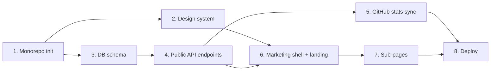

# Roadmap

## Openpawl Release Roadmap

Openpawl runtime development now belongs in the public
`codepawl/openpawl@v0.5.3` release line and later public releases. The private
`packages/core`, `packages/cli`, and `packages/shared` directories are frozen
compatibility copies until package-removal audit work proves they can be
deleted safely.

### Release history snapshot

- `v0.1.0-alpha.1`: Mock-first monorepo foundation, local dry-run, metadata-only patch plans, and PR workflow verification without production write mode.
- `v0.1.0-alpha.2`: Experimental OpenAI-compatible provider, structured-output retry, safer diagnostics, and GitHub workflow hardening.
- `v0.1.0-alpha.3`: `json_schema` strict mode, context compaction with budgets, grounding/rejection of provider paths, dry-run scope fallback for ungrounded proposals, and safe write-mode v0 guardrails.
- `v0.1.0-alpha.9`: first external installability cut with repo-root config, reusable workflow template, install docs, and safer write-mode defaults.
  - `v0.1.0-alpha.10`: maintainer mention UX with exact `@openpawl` commands, dry-run-only mention triggers, direct public Openpawl CLI workflow invocation that bypasses the target repo root Turbo script, and live issue/PR verification on GitHub Actions runs `27208458149`, `27208687623`, `27208690487`, and `27208692054`.
- `v0.1.0-beta.1`: approval write mode with bot-branch PR creation, safe create-chunk write policy, and a deterministic patch quality harness.
- `v0.2.0`: patch-quality reliability layer released. Harness expanded to 50 fixtures, with reliability metrics, failure taxonomy, and common add-tests safe-generation coverage.
- `v0.2.1`: post-release external installability patch. Fixed workflows to run the Openpawl CLI from a dynamically checked out `.openpawl-src` repository to resolve dependency-resolution failures in target repositories.
- `v0.2.2`: trigger command parity and workflow dispatch ergonomics patch. Added support for `/openpawl plan` and `/openpawl fix failing tests` slash dry-run commands, enabled manual `workflow_dispatch` trigger on the reusable workflow, and aligned trigger input schemas.
- `v0.3.0`: repository scanning reliability with `.gitignore` / `.openpawl-src` awareness and optional validation retry-loop.
- `v0.4.0`: Trace/Evidence Layer released with schema-versioned machine-readable artifacts and cross-artifact consistency checks.
- `v0.5.0`: Evidence UX Layer released with report/comment Evidence Summary, Failure Summary, and GitHub Actions artifact context while preserving schema v1 artifacts.
- `v0.5.1`: post-release reproducibility and GitHub Actions warning patch for v0.5.0.
- `v0.5.2`: Marketplace positioning and Action metadata patch for the reviewable agent work message.
- `v0.5.3`: Action evidence bundle patch adding `openpawl-evidence-bundle.json` for local CodePawl Cloud Evidence preview while preserving schema v1 artifacts.

### Maturity plan

- **Alpha:** CLI + dry-run + trace + CI verified; real-provider runs are experimental.
- **Beta (current):** v0.5.3 release; safe write-mode v0 with explicit test command, no source overwrite, PR workflow verified.
- **v0.2 Reliability (released):** 50-fixture deterministic patch-quality regression harness and failure-taxonomy coverage complete; live GitHub dry-run smoke pass achieved in `27273286439`.
- **v0.4 Trace/Evidence (released):** schema-backed JSON artifact contracts for run, trace, patch-plan, selected-files, applied-files, and eval metrics. Markdown reports remain human-readable.
- **v0.5 Evidence UX (released):** present existing schema v1 evidence more clearly in `report.md` and GitHub issue/PR comments without changing autonomous behavior or artifact JSON contracts.
- **RC:** validate on multiple real repositories, publish provider compatibility matrix, and stabilize failure/retry behavior.
- **0.1.0 stable:** safe write-mode and release packaging readiness for external users.

### v0.1.0-beta.1 implementation plan

**Goal:** Move Openpawl from runnable/installable to useful and safe for real repository work.

**Risk-ordered tasks:**

1. Add approval-gated write triggers without changing existing dry-run triggers:
   - exact `/openpawl apply` slash command only
   - `openpawl-approved` label for issue/PR approval
   - no write mode from `@openpawl` mentions
   - maintainer-only `/openpawl apply` using GitHub `author_association`
2. Persist approved writes as new bot branches and PRs:
   - run a fresh write-mode Openpawl execution from issue/PR context
   - keep current create-only/test-file-only write policy
   - push `openpawl/apply-<issue-or-pr-number>-<run-id>`
   - open a PR back to the default branch with run and validation details
   - requires a generated safe create chunk for `/openpawl apply`; arbitrary docs-only write requests without patch content still fail with `No safe create chunks available in write mode.`
   - if PR creation is blocked by org policy, branch push is still considered a successful apply step and the workflow records manual fallback instructions.

3. Add a deterministic patch quality harness:
   - CLI command `codepawl eval patch-quality`
   - 20-30 fixture cases using mock LLM responses and temp repos
   - metrics for useful report, accepted patch, validation pass, unsafe block, and irrelevant file touch
4. Update docs and release notes:
   - README and install docs list `/openpawl apply` and `openpawl-approved`
   - external install docs describe the new `contents: write` permission for approval writes
   - preserve direct public Openpawl CLI workflow invocation

**Validation commands:**

- `bun install`
- `bun run typecheck`
- `bun run test`
- `bun run build`
- `git diff --check`

### Publishing guidance

- Prefer GitHub Releases for current alpha tags.
- Do not publish to npm yet until package metadata, exports, bin entrypoint, files, license, README, and install path are verified.
- NPM alpha publish becomes appropriate only after the CLI works from a packed tarball in a temp repo.
- Stable publish requires safe write mode and at least **3** real-repo dry-run validations.

### Pre-publish checklist

- Run `npm pack` dry-run for package artifacts.
- Install CLI in a temporary repository and run `codepawl doctor`.
- Run `codepawl run --repo . --task "review current repository changes" --dry-run`.
- Confirm all expected artifacts (`trace.json`, `run.json`, `report.md`, `patch-plan.json`, `selected-files.json`, `applied-files.json`) and deterministic reports are produced.
- Confirm traces/reports include context-pack and compaction metrics and no secrets.
- Confirm GitHub Action docs still match workflow behavior.
- Confirm license and package metadata are explicit and consistent.

8 phases to MVP. Execute in order unless explicitly marked parallel. Each phase is a standalone Claude Code prompt with its own context, requirements, and verification.

Before starting any phase, read `CLAUDE.md` and the files listed in `<context>` for that phase.

---

## Phase 1: Monorepo init and tooling

<goal>
Stand up the Bun workspace monorepo with `apps/web`, `apps/api`, and `packages/shared`. Wire formatter, linter, typechecker, and git hooks. No app code yet.
</goal>

<context>
Read these before starting:
- `CLAUDE.md`
- `docs/ARCHITECTURE.md` (Monorepo layout, Conventions sections)
- `docs/OPS.md` (Development environment section)
</context>

<requirements>
- Initialize Bun workspaces at repo root with `package.json` containing `workspaces: ["apps/*", "packages/*"]`
- Create `apps/web/` with Next.js 16 App Router, TypeScript `strict: true`, `noUncheckedIndexedAccess: true`, Tailwind v4
- Create `apps/api/` with `pyproject.toml`, Python 3.12+, FastAPI, uvicorn, pydantic, structlog, slowapi, ruff, mypy
- Create `packages/shared/` with TypeScript only, no runtime code yet, just `package.json` exporting `./types`
- Add `.gitignore` from the provided template
- Add `.env.example` with all required variables
- Add `.editorconfig` enforcing 100-char line length, LF endings, 2 spaces for JS/TS, 4 spaces for Python
- Set up pre-commit hooks: ruff format and check for Python staged files, biome or prettier for JS/TS staged files
- Configure GitHub Actions workflow at `.github/workflows/ci.yml` running lint, typecheck, and a placeholder test job for both stacks
- Add `bun --filter` aliases in root `package.json` for `dev`, `build`, `lint`, `typecheck`, `test` across web and shared
</requirements>

<verification>
- Run: `bun install` (succeeds without warnings about peer deps)
- Run: `bun --filter @codepawl/web typecheck` (passes on the default Next.js scaffold)
- Run: `cd apps/api && uv sync && uv run mypy . && uv run ruff check .` (all pass)
- Manual check: `bun --filter @codepawl/web dev` serves the default Next.js page on `http://localhost:3000`
- Manual check: `cd apps/api && uv run uvicorn app.main:app` returns 200 on `GET /health` (a minimal placeholder)
</verification>

<done_when>
- [x] Both workspaces install and run with zero warnings
- [x] All linters and typecheckers pass on the scaffold
- [x] CI workflow runs green on a placeholder PR
- [x] `.env.example` matches the variables listed in `OPS.md`
</done_when>

**Status**: ✓ complete (2026-05-19)

---

## Phase 2: Design system and fonts

<goal>
Port the design tokens and three variable fonts from the provided template into `apps/web`. Tailwind v4 `@theme` generates utilities matching the tokens. Original phase guidance enforced sharp corners globally; current radius guidance is rounded-industrial and documented in `docs/UI.md` and `.agents/design/CODEPAWL_DESIGN_SYSTEM.md`. Dark mode default with light-mode opt-in via `next-themes`.
</goal>

<context>
Read these before starting:
- `CLAUDE.md`
- `docs/UI.md`
- `docs/ARCHITECTURE.md` (Stack rationale section)
- Source template files (provided separately): `design/colors_and_type.css`, `design/fonts/*.ttf`
</context>

<requirements>
- Copy the 6 TTF files (Fraunces, Fraunces-Italic, InterTight, InterTight-Italic, JetBrainsMono, JetBrainsMono-Italic) into `apps/web/public/fonts/`
- Create `apps/web/lib/fonts.ts` declaring three `localFont` instances with `variable` set to `--font-display`, `--font-body`, `--font-mono`. Use `display: 'swap'`
- Create `apps/web/styles/design-tokens.css` porting the `:root` block from `colors_and_type.css` (all ink, fg, ratchet, blueprint, semantic, spacing, type-scale, motion, layout tokens)
- Create `apps/web/app/globals.css` that imports Tailwind, imports design tokens, defines an `@theme` block mapping color, font, spacing, and radius tokens so Tailwind utilities (`bg-ink-1`, `text-fg-2`, `font-display`, `rounded-md`, etc.) generate correctly
- Radius guidance superseded by the rounded-industrial system: interactive and content surfaces use `--cp-radius-*`; structural frames stay mostly sharp.
- Apply the three font variables to `<html>` in `apps/web/app/layout.tsx`
- Install `next-themes`, wrap the app in `ThemeProvider` with `attribute="class"` and `defaultTheme="dark"`
- Verify variable font axes work: Fraunces uses `opsz` and `SOFT` per the template's `font-variation-settings`
- Provide one minimal `apps/web/app/page.tsx` that demonstrates each font and a sample of color tokens (this gets replaced in Phase 4)
</requirements>

<verification>
- Run: `bun --filter @codepawl/web build` (zero warnings about font loading)
- Manual check: open localhost, all three fonts render correctly. Inspect computed `font-family` on a `.font-display` element
- Manual check: `rounded-lg`, `rounded-xl`, `rounded-md`, and `rounded-full` map to the shared rounded-industrial radius scale
- Manual check: light/dark toggle switches background and foreground colors smoothly
- Manual check: variable font axes work, Fraunces italic on the test heading renders with `opsz` 144 and `SOFT` 50
</verification>

<done_when>
- [x] All fonts load locally with zero network calls to Google Fonts
- [x] Tailwind utilities `bg-ink-0` through `bg-ink-6`, `text-fg-1` through `text-fg-5`, `bg-ratchet`, `border-ratchet` all generate
- [x] Dark mode default, light mode toggle works
- [x] Original sharp-corner pass completed; current system uses rounded-industrial surface radii
- [x] CSS file size budget: tokens + Tailwind output under 50KB gzipped before any component code
</done_when>

**Status**: ✓ complete (2026-05-19)

---

## Phase 3: Database schema and migrations

<goal>
Create Supabase migrations for the six MVP tables (newsletter_subscribers, newsletter_events, contact_submissions, contact_replies, products, product_stats). Seed the `products` table with the six products. RLS policies set per the data doc.
</goal>

<context>
Read these before starting:
- `CLAUDE.md`
- `docs/DATA.md`
- `docs/ARCHITECTURE.md` (apps/api section)
</context>

<requirements>
- Install Supabase CLI locally (`brew install supabase/tap/supabase` or equivalent). Add `supabase` to `apps/api/pyproject.toml` dev deps if a Python wrapper is needed
- Run `cd apps/api && supabase init` to set up the Supabase project structure
- Create migration files in `apps/api/migrations/` for each table, timestamped:
  - `newsletter_subscribers` with the schema from `DATA.md`
  - `newsletter_events` with cascade FK
  - `contact_submissions`
  - `contact_replies`
  - `products`
  - `product_stats`
- Add indexes per `DATA.md`
- Enable RLS on every table and add the policies described in `DATA.md` (deny anon except `select` on `products` and `product_stats`)
- Create a seed script at `apps/api/seed/products.py` that inserts the six product rows
- Document the migration commands in `apps/api/README.md`
</requirements>

<verification>
- Run: `cd apps/api && uv run supabase migration up --linked` (apply to a dev Supabase project)
- Run: `cd apps/api && uv run python -m seed.products` (seeds six products)
- Manual check: in Supabase dashboard, all six tables exist with correct columns, indexes, and RLS policies enabled
- Manual check: `select * from products` returns 6 rows. `select * from newsletter_subscribers` returns 0
- Manual check: anon role cannot read `newsletter_subscribers` (RLS denies)
</verification>

<done_when>
- [x] All 6 migrations apply cleanly from empty DB
- [x] All 6 migrations apply cleanly on a DB that already had them (idempotency)
- [x] Seed script is idempotent (re-running does not duplicate rows)
- [x] RLS verified: anon cannot read subscribers, but can read products
</done_when>

**Status**: ✓ complete (2026-05-19)

---

## Phase 4: FastAPI public endpoints (newsletter, contact, products)

<goal>
Implement the public endpoints in `docs/API.md` minus the admin endpoints. Wire Turnstile verification, Resend email sending, slowapi rate limiting, structlog logging, Sentry error capture. No background jobs yet.
</goal>

<context>
Read these before starting:
- `CLAUDE.md`
- `docs/API.md`
- `docs/ARCHITECTURE.md` (apps/api section, sequence diagrams)
- `docs/DATA.md`
</context>

<requirements>
- Scaffold `apps/api/app/main.py` with FastAPI app factory, CORS middleware (allow `http://localhost:3000`, `https://codepawl.com`, `https://www.codepawl.com`), Sentry init, slowapi limiter init, structlog config
- Create routers in `apps/api/app/routers/`: `newsletter.py`, `contact.py`, `products.py`, `health.py`
- Create services in `apps/api/app/services/`: `newsletter_service.py`, `email_service.py` (Resend wrapper), `turnstile_service.py`
- Create repositories in `apps/api/app/repositories/`: `subscriber_repo.py`, `submission_repo.py`, `product_repo.py`, `product_stats_repo.py`
- Pydantic models in `apps/api/app/models/` for every request and response shape in `docs/API.md`
- Implement endpoints exactly as specified in `docs/API.md`:
  - `POST /api/v1/newsletter/subscribe` (Turnstile verify, insert pending, send confirm email via Resend)
  - `GET /api/v1/newsletter/confirm` (token lookup, set confirmed_at, log event)
  - `POST /api/v1/newsletter/unsubscribe` (token lookup, set unsubscribed_at)
  - `POST /api/v1/contact` (Turnstile verify, insert row, forward email to hello@codepawl.com)
  - `GET /api/v1/products` (list)
  - `GET /api/v1/products/{slug}` (detail)
  - `GET /api/v1/products/{slug}/stats` (cached stats row)
  - `GET /health` and `GET /health/ready`
- Apply rate limits per `docs/API.md` (5/min on newsletter and contact, 30 or 60/min elsewhere)
- Use the FastAPI dependency pattern for shared concerns: Turnstile verification dependency, Supabase client dependency
- React Email template at `apps/api/app/email_templates/newsletter_confirm.tsx` (if using react-email Python wrapper) or inline HTML; minimal but on-brand
</requirements>

<verification>
- Run: `cd apps/api && uv run pytest` (all new unit and integration tests green)
- Run: `cd apps/api && uv run mypy .` (zero errors)
- Run: `cd apps/api && uv run ruff check .` (zero errors)
- Manual check: open `http://localhost:8000/docs` (Swagger), every endpoint listed
- Manual check: `curl -X POST http://localhost:8000/api/v1/newsletter/subscribe` with a valid Turnstile dev token returns 202; the row appears in `newsletter_subscribers` with `confirmed_at = null`
- Manual check: Resend dev account receives the confirmation email
- Manual check: clicking the confirm link in the email returns 200 and the row's `confirmed_at` updates
- Manual check: rate limit kicks in after 6 rapid newsletter POSTs from the same IP
</verification>

<acceptance_criteria>
Given a visitor with a valid email and Turnstile token
When they POST to `/newsletter/subscribe`
Then a `pending` row is created, a confirmation email is sent via Resend, and the response is 202

Given a subscriber clicks the confirmation link within 7 days
When they hit `GET /newsletter/confirm?token=...`
Then their row's `confirmed_at` is set to now and the response is 200

Given a subscriber tries to confirm with an expired or invalid token
When they hit `GET /newsletter/confirm?token=...`
Then the response is 410 with code `expired` or `invalid_token`

Given a visitor with a valid Turnstile token submits the contact form
When they POST to `/contact`
Then a row is inserted in `contact_submissions`, an email is forwarded to `hello@codepawl.com`, and the response is 201

Given the products are seeded
When a visitor GETs `/products`
Then the response is 200 with all 6 products in `display_order` order
</acceptance_criteria>

**Status**: ✓ complete (2026-05-19)

---

## Phase 5: GitHub stats sync job

<goal>
Implement the APScheduler background job that fetches GitHub stats for the six products every 6 hours and upserts into `product_stats`. Implement the admin endpoint to trigger a manual sync.
</goal>

<context>
Read these before starting:
- `CLAUDE.md`
- `docs/API.md` (admin endpoints, GitHub sync sequence diagram)
- `docs/ARCHITECTURE.md` (sequence diagram for stats sync)
- `docs/DATA.md` (product_stats table)
</context>

<requirements>
- Implement `apps/api/app/services/github_service.py` with functions `fetch_repo_stats(repo: str)` and `fetch_latest_release(repo: str)`, using `httpx.AsyncClient` and the `GITHUB_TOKEN` env var
- Implement `apps/api/app/jobs/sync_github_stats.py` as an async function that iterates the 6 products and upserts stats
- Wire APScheduler in `apps/api/app/main.py`: schedule `sync_github_stats` every 6 hours, run once on startup after a 30-second delay (to let the app warm up)
- Implement admin endpoint `POST /admin/products/sync-stats` that triggers the job manually. Auth: `X-Admin-Key` header check. Optional body `{"product_ids": [...]}` to scope
- Handle GitHub API rate limits gracefully: log to Sentry as a warning breadcrumb, do not crash the job
- Handle missing repo (404 from GitHub) by skipping that product and logging a warning
- Sync timestamp goes in `synced_at` even on partial failure
</requirements>

<verification>
- Run: `cd apps/api && uv run pytest tests/jobs/test_sync_github_stats.py` (mocked GitHub responses)
- Manual check: start the API, wait 30 seconds, observe in logs that the job ran and populated `product_stats`
- Manual check: `curl http://localhost:8000/api/v1/products/openpawl/stats` returns non-zero stars
- Manual check: `curl -X POST -H "X-Admin-Key: $ADMIN_API_KEY" http://localhost:8000/api/v1/admin/products/sync-stats` triggers a manual run and returns 202
- Manual check: missing admin key returns 401
</verification>

<done_when>
- [x] Cron job runs on startup and every 6 hours
- [x] All 6 products have a row in `product_stats` after first run
- [x] Manual trigger endpoint works with correct admin key, returns 401 without
- [x] GitHub 404 on a missing repo does not crash the job
- [x] Sentry breadcrumbs visible for each sync run
</done_when>

**Status**: ✓ complete (2026-05-19)

---

## Phase 6: Marketing route group and landing page

<goal>
Build the `(marketing)` route group with the landing page from the provided template. Port Nav, Hero (with cycling product showcase), TrustedBy, Formats, Features, SDKDemo, Pricing teaser, Testimonials, CTA, Footer. Hero is "use client", everything else is Server Component where possible.
</goal>

<context>
Read these before starting:
- `CLAUDE.md`
- `docs/UI.md`
- `docs/ARCHITECTURE.md` (apps/web section)
- Source template files: `Landing Page.html`, `design/components/*.jsx`
</context>

<requirements>
- Create `apps/web/app/(marketing)/layout.tsx` with the shared marketing shell (Nav, Footer wrapper, `<main>` slot). Do not import Ant Design
- Create `apps/web/app/(marketing)/page.tsx` as the landing page
- Port the 10 components from `design/components/` into `apps/web/components/marketing/`:
  - `Nav.tsx` (Server, with `usePathname`-driven active state) requires `"use client"` only if pathname check needed; prefer Server with active state via props
  - `Hero.tsx` ("use client", cycling 6 products, terminal typing animation using `motion/react`)
  - `TrustedBy.tsx` (Server)
  - `Features.tsx` (Server)
  - `Formats.tsx` (Server)
  - `SDKDemo.tsx` ("use client", code typing animation)
  - `Pricing.tsx` teaser version (Server)
  - `Testimonials.tsx` (Server)
  - `CTA.tsx` ("use client" if it contains the newsletter form; otherwise Server)
  - `Footer.tsx` ("use client" because of newsletter form; or split into `Footer.tsx` server + `FooterNewsletterForm.tsx` client)
- Replace inline `style={{ }}` from the template with Tailwind utilities backed by the design tokens. Where Tailwind cannot express a value, use `style={{ }}` with `var(--token)` (acceptable)
- Replace `` to the actual routes (`/products`, `/research`, `/docs`, `/pricing`, `/blog`, `/careers`)
- Use `react-bootstrap-icons` for any iconography. No Lucide
- Use `motion/react` for the Hero cycler and SDKDemo. Respect `prefers-reduced-motion`
- The 6-product data lives in `apps/web/components/marketing/products.ts` as a TS const (not from DB, since this is design copy not state)
- Drop the `TweaksPanel` from the template entirely; production does not need it
- Set `export const revalidate = 3600` on the landing page
- Add `<head>` metadata via the App Router `metadata` export: title, description, og:image, canonical
</requirements>

<verification>
- Run: `bun --filter @codepawl/web build` (no errors, no warnings about client/server boundary violations)
- Run: `bun --filter @codepawl/web typecheck` (passes)
- Manual check: landing page renders identically to the template at `localhost:3000`
- Manual check: hero cycler advances every ~7 seconds, terminal typing animation plays
- Manual check: clicking a product chip in the hero jumps to that product
- Manual check: navigation between marketing pages works
- Manual check: light mode toggle does not break any section
- Manual check: Lighthouse mobile score 90+ on Performance, Accessibility, SEO
- Manual check: bundle size of the landing page is under 150KB JS (gzipped) excluding fonts
</verification>

<acceptance_criteria>
Given a visitor lands on `/`
When the page finishes loading
Then they see the hero with one of the six products active, the navigation, and the footer with newsletter form

Given a visitor clicks a product chip in the hero
When the click handler fires
Then the hero advances to that product and the side detail panel updates

Given a visitor scrolls through the page
When they reach each section
Then sections render in the order: Nav, Hero, TrustedBy, Formats, Features, SDKDemo, Pricing, Testimonials, CTA, Footer

Given a user has `prefers-reduced-motion: reduce` set
When they load the landing page
Then the hero cycler does not auto-advance, and all animations collapse to instant transitions
</acceptance_criteria>

**Status**: ✓ complete (2026-05-19)

---

## Phase 7: Marketing sub-pages (Products, Research, Docs, Blog, Careers, Pricing, Contact)

<goal>
Build the remaining marketing pages. MDX wiring for blog, research, careers. GitHub-fetched MDX for `/docs`. Form pages for `/contact` and the newsletter confirm route.
</goal>

<context>
Read these before starting:
- `CLAUDE.md`
- `docs/UI.md` (Screens section)
- `docs/API.md` (contact, newsletter confirm endpoints)
- Source template pages: `pages/Products.html`, `pages/Research.html`, `pages/Docs.html`, `pages/Pricing.html`, `pages/Blog.html`, `pages/Careers.html`
</context>

<requirements>
- `apps/web/app/(marketing)/products/page.tsx`: grid of all 6 product cards. Fetches `GET /api/v1/products` and per-product stats in parallel. ISR 1 hour
- `apps/web/app/(marketing)/products/[slug]/page.tsx`: detail page per product. Static MDX content at `apps/web/content/products/{slug}.mdx`. Dynamic stats fetched from API. `generateStaticParams` returns all 6 slugs
- `apps/web/app/(marketing)/research/page.tsx`: index of MDX files in `apps/web/content/research/`. Sort by frontmatter date desc
- `apps/web/app/(marketing)/research/[slug]/page.tsx`: render a research entry MDX
- `apps/web/app/(marketing)/blog/page.tsx`: index of MDX files in `apps/web/content/blog/`. Reverse chronological
- `apps/web/app/(marketing)/blog/[slug]/page.tsx`: render a blog post MDX with custom components (code block with copy button, RepoCard, KaTeX, YouTube embed)
- `apps/web/app/(marketing)/docs/page.tsx` and `apps/web/app/(marketing)/docs/[[...path]]/page.tsx`: fetch MDX from internal product repos via the GitHub API. ISR with admin-triggered revalidation. Defer the GitHub MDX fetch piece to a sub-phase if it stalls; ship a static `/docs` first
- `apps/web/app/(marketing)/careers/page.tsx`: list MDX in `apps/web/content/careers/`. Empty state if none open
- `apps/web/app/(marketing)/pricing/page.tsx`: 3-tier static comparison. CTAs link to `/contact` and the KStudio waitlist
- `apps/web/app/(marketing)/contact/page.tsx`: form posting to `POST /api/v1/contact`. Turnstile widget. Idle, submitting, success, error states
- `apps/web/app/(marketing)/newsletter/confirm/page.tsx`: parses `?token` from URL, calls `GET /api/v1/newsletter/confirm`, renders one of: loading, success, error (with re-subscribe link)
- 404 and 500 pages at `apps/web/app/not-found.tsx` and `apps/web/app/error.tsx` (note error.tsx must be a client component)
- Each page exports `metadata` for title and description
- All MDX content uses `next-mdx-remote` (or the new built-in if Next 16 has stabilized it), with custom components registered once in a shared MDX provider
</requirements>

<verification>
- Run: `bun --filter @codepawl/web build` (all routes generate)
- Run: `bun --filter @codepawl/web typecheck`
- Manual check: every URL listed in `docs/UI.md` Screens section loads successfully in dev
- Manual check: products grid shows live stars from the synced data
- Manual check: blog post renders MDX with code blocks, KaTeX math, YouTube embed
- Manual check: contact form, on submit with valid Turnstile token, lands a row in `contact_submissions` and shows the success state
- Manual check: newsletter confirm flow end to end: submit on landing, click email link, land on `/newsletter/confirm`, success
- Manual check: invalid newsletter token shows the error state with a re-subscribe option
</verification>

<acceptance_criteria>
Given a visitor goes to `/products`
When the page loads
Then they see a grid of 6 product cards each with name, tagline, language badge, and current stars

Given a visitor submits the contact form with a valid Turnstile token and well-formed data
When the POST returns 201
Then they see a success state thanking them and an admin sees a new row in `contact_submissions`

Given a visitor clicks the email confirmation link from a successful subscribe
When they land on `/newsletter/confirm?token=...`
Then the page shows a success state and the subscriber row's `confirmed_at` is updated

Given an MDX blog post uses the `RepoCard` and `KaTeX` custom components
When the page renders
Then both components display correctly with no console errors
</acceptance_criteria>

**Status**: ✓ complete (2026-05-19)

---

## Phase 8: Deploy to staging and production

<goal>
Deploy the API to Koyeb and the web to Vercel (or Koyeb). Wire DNS, SSL, environment secrets, Sentry source maps, PostHog event tracking. Run smoke tests against production.
</goal>

<context>
Read these before starting:
- `CLAUDE.md`
- `docs/OPS.md`
- `docs/TESTING.md` (E2E flows that must be green before deploy)
</context>

<requirements>
- Provision Supabase production project (separate from dev). Apply migrations and seed
- Provision Resend production API key. Verify the `codepawl.com` sending domain (SPF, DKIM, DMARC records on Cloudflare DNS)
- Provision Cloudflare Turnstile production widget for `codepawl.com` and `www.codepawl.com`
- Provision Sentry projects (one for web, one for API) and capture the DSNs
- Provision PostHog project and capture the public key
- Create `apps/api/Dockerfile` multi-stage (build with uv, runtime with slim Python 3.12)
- Deploy API to Koyeb. Set env vars from `.env.example`. Configure health check on `/health/ready`
- Deploy web to Vercel (or Koyeb). Set env vars. Configure ISR
- Configure DNS in Cloudflare: `codepawl.com` and `www.codepawl.com` to web host, `api.codepawl.com` to API host, staging subdomains for the staging branch
- Upload Sentry source maps on every deploy (web build plugin + sentry-cli for API)
- Add `.github/workflows/deploy-staging.yml` and `deploy-prod.yml` workflows
- Add a PostHog event for newsletter `confirmed` so we can track the funnel
- Run all Playwright E2E tests against staging before promoting to prod
- Verify production smoke checks: landing loads under 2s, newsletter signup completes confirm flow, contact form submits, product stats visible
</requirements>

<verification>
- Run: `bun --filter @codepawl/web build` against production env vars (no warnings)
- Run: Playwright E2E suite against staging URL (all green)
- Manual check: visit `https://codepawl.com`, full page loads under 2 seconds on a cold cache
- Manual check: subscribe to the newsletter with a real email, confirm flow works end-to-end, email arrives from `hello@codepawl.com`
- Manual check: submit the contact form, email arrives at the team inbox
- Manual check: Sentry dashboard shows zero new errors 30 minutes post-deploy
- Manual check: PostHog dashboard shows page views and a `newsletter_confirmed` event
- Manual check: GitHub stats sync ran in production within 30 minutes of API deploy, `/api/v1/products/openpawl/stats` returns non-zero stars
- Manual check: `prefers-reduced-motion` honored, dark mode default, keyboard nav works
</verification>

<done_when>
- [ ] `https://codepawl.com` resolves and serves the landing page
- [ ] `https://api.codepawl.com/health/ready` returns 200
- [ ] Newsletter signup works end-to-end in production with a real email address
- [ ] Contact form lands a real email at the team inbox
- [ ] Sentry, PostHog, and Cloudflare Turnstile all show production traffic
- [ ] Sitemap, robots.txt, and an RSS feed for `/blog` are accessible
- [ ] Lighthouse production audit: Performance 90+, Accessibility 95+, SEO 100
</done_when>

---

## Parallel-eligible phases

- Phase 6 and Phase 5 can run in parallel after Phase 4 ships (web devs build the landing while back end finishes the cron job)
- Phase 7 starts after Phase 6 lands the marketing shell
- Phase 8 is the final phase, no parallelism

## Dependencies graph

